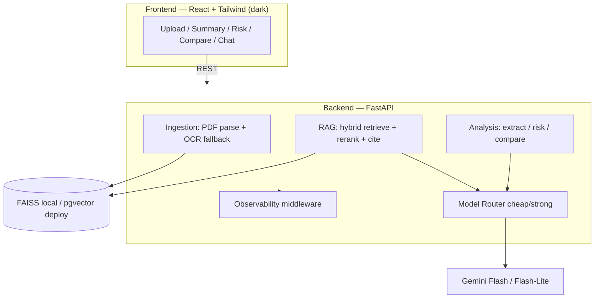

# ClauseLens — AI Contract Analysis & Comparison

> Upload a contract (PDF) and get structured clause extraction, auto risk-flagging,
> version-diff classification, and a **citation-grounded Q&A chat** — built as a
> **production AI system** with an evaluation harness, observability, and cost-aware
> model routing.

<!-- BADGES (filled in once CI + deploy are live) -->
[](https://github.com/USERNAME/clauselens/actions/workflows/ci.yml)

🔗 **Live demo:** _coming soon (Hugging Face Space)_  ·  🖼️ _screenshot/GIF coming soon_

---

## Why this project

ClauseLens is a **retrieval-augmented generation (RAG)** application for legal
contracts. It demonstrates application-layer AI engineering end to end: a grounded
RAG pipeline with hybrid retrieval and reranking, **structured outputs** for clause
extraction, an **LLM-as-Judge evaluation harness**, request-level **observability**
(latency / tokens / cost), and **model routing** for cost optimization.

> Keywords: production AI system · RAG · retrieval-augmented generation ·
> LLM-as-Judge · evaluation harness · observability · cost optimization ·
> model routing · vector database · pgvector · structured outputs ·
> grounded generation · prompt caching · multi-provider orchestration.

## Features

- **Clause summary** — parties, term, payment, liability, termination (structured).
- **Risk flags** — auto-detected unusual/risky clauses.
- **Compare mode** — classifies every change between two versions as
  **Structural / Semantic / Surface-level**.
- **Grounded Q&A chat** — answers cite the exact clause/page they came from.

## Architecture



## Engineering decisions & tradeoffs

_(expanded as each component lands; the “why” behind every choice lives here)_

- **Vector store behind an interface** — FAISS locally (zero infra), pgvector
  (Supabase) in deploy; swap via `VECTOR_BACKEND`.
- **Hybrid retrieval + rerank** — semantic + BM25 fused with Reciprocal Rank Fusion,
  then a cross-encoder reranker, because exact legal terms (`Section 7.2`,
  `indemnify`) are missed by pure vector search.
- **Model routing** — cheap model (`gemini-2.5-flash-lite`) for extractive/simple
  work, strong (`gemini-2.5-flash`) for reasoning. Real per-token cost accounting
  even on the free tier, so cost-per-query is a defensible number.

## Eval results

_(populated by `make eval` — baseline vs improved scorecard)_

| Metric | Baseline | Improved |
|---|---|---|
| Correctness | – | – |
| Groundedness | – | – |
| Citation accuracy | – | – |
| Pass rate | – | – |

**Cost per query:** _TBD_

## Run locally (<5 commands)

```bash
cp .env.example .env          # add your free Gemini key (aistudio.google.com/apikey)
make install                  # backend + extras (pip install -e ".[rag,ocr,pg,dev]")
make test                     # fast unit suite
make dev                      # API at http://localhost:8000  (/health, /docs)
```

## Deploy

_(Hugging Face Space, Docker SDK — instructions added with the Dockerfile)_

## Known limitations

_(documented honestly as the system matures)_

## License

MIT. Sample contracts are public data only (CUAD / SEC EDGAR) — see
[`data/samples/SOURCES.md`](data/samples/SOURCES.md).
